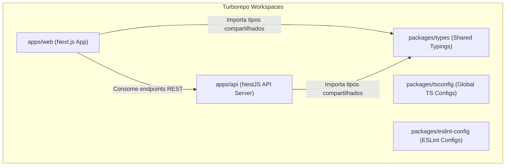
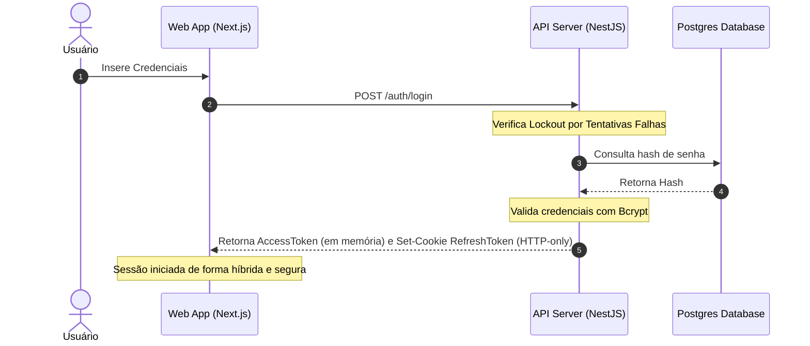

# 🗺️ Atlas HRMS — Sistema de Gestão de Pessoas e ATS Corporativo

O **Atlas HRMS** é um ecossistema corporativo completo de gerenciamento de recursos humanos e rastreamento de candidatos (ATS - Applicant Tracking System). Projetado sobre uma arquitetura de monorepo moderna e escalável, o sistema integra de ponta a ponta as rotinas operacionais de departamento pessoal, ponto eletrônico digital com banco de horas, gerenciamento de ausências por conformidade CLT, controle de cargos/departamentos estruturados e um portal público de vagas integrado.

Este repositório foi construído para servir como uma referência de código limpo, aplicação estrita de segurança corporativa, testes abrangentes e práticas premium de design system.

---

## 🏛️ Arquitetura do Sistema e Monorepo

O projeto está estruturado como um monorepo gerenciado pelo **Turborepo**, permitindo compilações paralelas otimizadas, cache remoto de etapas de build e compartilhamento dinâmico de tipos de domínio:

---

## 🚀 Módulos e Destaques Técnicos

### 1. Portal de Carreiras e ATS Integrado (Público & Privado)
- **Portal Público de Vagas**: Listagem responsiva em grid de 100% de largura, com filtros dinâmicos rápidos por **Senioridade**, **Modelo de Trabalho** e **Regime de Contratação**, sem necessidade de autenticação.
- **Formulário de Candidatura**: Envio de dados pessoais e upload assíncrono de currículos em formato PDF integrado diretamente à infraestrutura na nuvem via **UploadThing SDK**.
- **Quadro Kanban de Recrutamento (ATS)**: Interface interativa baseada em `@dnd-kit/core` permitindo mover candidatos entre as fases seletivas (`Triagem`, `Entrevista RH`, `Teste Técnico`, `Proposta`, `Contratado` ou `Recusado`) com atualizações otimistas no frontend e suporte a reversão (rollback) automática em caso de falhas na rede.
- **Conversão Automática**: A contratação de um candidato aceito transiciona automaticamente seus dados em um registro ativo de colaborador (`Employee`) vinculado ao cargo da vaga.

### ⏰ 2. Controle de Ponto Digital e Banco de Horas
- **Marcação Digital**: Registro eletrônico integrado de batidas diárias (Entrada, Almoço, Retorno, Saída) com captura de horário oficial do servidor.
- **Banco de Horas Automático**: Cálculo automático de saldos de jornada acumulada no banco de horas por colaborador.
- **Ajustes de Inconsistências**: Módulo administrativo protegido por RBAC permitindo que gestores aprovem ou recusem solicitações retroativas de correções de batidas feitas por colaboradores.

### 🏖️ 3. Gestão de Férias e Ausências por Conformidade
- **Controle Aquisitivo**: Trava de segurança que impede solicitações de férias para colaboradores com menos de 1 ano de tempo de serviço ativo.
- **Central de Atestados**: Fluxo de upload de justificativas médicas com comprovantes armazenados em storage na nuvem.

### 🏢 4. Estrutura de Cargos e Departamentos
- **Organograma Corporativo**: CRUD estruturado de setores organizacionais e definição hierárquica de cargos.
- **Unicidade de Cargo**: Trava no banco de dados impedindo nomes duplicados de cargos no mesmo departamento.
- **Workflow de Soft-Restore**: Mecanismo inteligente de restauração de registros marcados como excluídos (`deletedAt`) e reativação automática de vínculos perdidos.

---

## 🔐 Segurança e Conformidade Corporativa

O Atlas HRMS foi projetado com rígidos padrões de segurança e compliance:

- **Tokens JWT Híbridos**: O token de acesso (`AccessToken`) é guardado apenas em memória de curto prazo (variável de estado no cliente), enquanto o token de renovação (`RefreshToken`) é trafegado exclusivamente via **Cookie HTTP-only** com as flags de segurança ativas (`Secure`, `HttpOnly`, `SameSite=Strict`), bloqueando vulnerabilidades de XSS.
- **Lockout por Tentativas Falhas**: Bloqueio temporário e progressivo de login de contas de usuários (10 ou 30 minutos) após repetidas falhas de autenticação como proteção contra ataques de força bruta.
- **RBAC (Role Based Access Control)**: Restrição automatizada de endpoints baseada em funções (`ADMIN`, `HR`, `MANAGER`, `EMPLOYEE`) injetadas via decorators e verificadas por guards no pipeline do NestJS.
- **Logs de Auditoria (Audit Trail)**: Rastreabilidade total de todas as ações de escrita executadas no banco de dados (ex: `EMPLOYEE_CREATED`, `VACATION_APPROVED`, `CANDIDATE_STATUS_CHANGED`), identificando usuário executor, IP e payload da mudança.

---

## 🛠️ Stack Tecnológica

### Frontend (Portal & Painel)
- **Core**: Next.js 16 (App Router, Turbopack) & React 19
- **Design System**: TailwindCSS & Componentes customizados baseados no **Shadcn/UI**
- **Internacionalização**: `next-intl` com suporte completo a chaves de tradução dinâmicas e localizadas em Português, Inglês e Espanhol
- **Consumo de API**: TanStack Query (React Query v5) com mutações de cache
- **Gestão de Estado**: Zustand

### Backend (API Server)
- **Framework**: NestJS (TypeScript) estruturado com injeção de dependência nativa
- **Banco de Dados**: PostgreSQL & Prisma ORM
- **Cloud Storage**: UploadThing SDK
- **Segurança**: Passport.js, JWT, Cookies assinados e Bcrypt

---

## 🧪 Qualidade de Código e CI/CD

- **Testes Abrangentes**: Cobertura obrigatória de testes unitários (`.spec.ts`) e testes de integração com banco de dados em memória (`supertest`).
- **Garantia de Estilo e Padronização**: Linter (ESLint) e formatador de código (Prettier) integrados.
- **Git Hooks (Husky)**: Bloqueio local automático que impede commits se houver lints pendentes ou falhas em testes de integração executados em pre-commit.
- **GitHub Actions**: Workflow de CI integrado rodando build, lint e testes a cada Pull Request.

---

## 📚 Documentação Técnica Completa

Todas as especificações técnicas, diagramas adicionais e guias de infraestrutura detalhados do monorepo estão divididos nos seguintes artigos na pasta `/docs`:

- [**Sumário e Índice Técnico Geral (INDEX.md)**](file:///c:/Users/Guilherme/Desktop/PROJETOS/atlas-hrms/docs/INDEX.md)
- [Arquitetura do Monorepo & Fluxos](file:///c:/Users/Guilherme/Desktop/PROJETOS/atlas-hrms/docs/architecture.md)
- [Modelo de Entidade-Relacionamento e Dicionário de Banco de Dados](file:///c:/Users/Guilherme/Desktop/PROJETOS/atlas-hrms/docs/database.md)
- [Autenticação JWT, Lockout de Segurança e RBAC](file:///c:/Users/Guilherme/Desktop/PROJETOS/atlas-hrms/docs/authentication.md)
- [Módulo de Controle de Ponto Digital](file:///c:/Users/Guilherme/Desktop/PROJETOS/atlas-hrms/docs/time-attendance.md)
- [Módulo de Férias e Ausências CLT](file:///c:/Users/Guilherme/Desktop/PROJETOS/atlas-hrms/docs/vacations-leaves.md)
- [Estrutura de Candidaturas e Fluxo ATS](file:///c:/Users/Guilherme/Desktop/PROJETOS/atlas-hrms/docs/recruitment.md)
