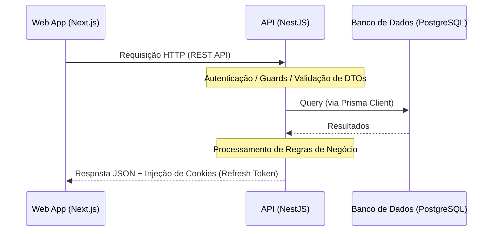

# 🏛️ Arquitetura do Sistema

O **Atlas HRMS** é um sistema moderno de gestão de recursos humanos estruturado na forma de um **Monorepo** focado em alto desempenho, escalabilidade e facilidade de manutenção.

---

## 🛠️ Tecnologias e Ferramentas

O projeto utiliza um conjunto de tecnologias de ponta em TypeScript:

- **Orquestrador de Monorepo**: [Turborepo](https://turbo.build/) — Gerencia as dependências internas, cache de builds e tarefas concorrentes.
- **Frontend (Web App)**: [Next.js 16 (App Router)](https://nextjs.org/) — Interface do usuário robusta, renderizada no servidor e otimizada.
- **Backend (API)**: [NestJS 11](https://nestjs.com/) — Estrutura de servidor modular e opinativa voltada para escalabilidade corporativa.
- **Banco de Dados (ORM)**: [Prisma](https://www.prisma.io/) — Abstração de banco de dados robusta e totalmente tipada.
- **Gerenciador de Pacotes**: [pnpm](https://pnpm.io/) — Instalação rápida e economia de espaço em disco usando cache global.

---

## 📁 Estrutura do Monorepo

O monorepo é dividido em duas áreas principais: `apps/` (aplicativos executáveis) e `packages/` (configurações e bibliotecas compartilhadas).

```text
atlas-hrms/
├── apps/
│   ├── api/                 # API REST desenvolvida em NestJS
│   └── web/                 # Aplicação frontend desenvolvida em Next.js
├── packages/
│   ├── eslint-config/       # Regras compartilhadas de Linting
│   ├── tsconfig/            # Configurações compartilhadas do compilador TypeScript
│   └── types/               # Tipagens e interfaces globais compartilhadas
├── docs/                    # Documentação técnica do sistema
└── pnpm-workspace.yaml      # Definição dos workspaces do pnpm
```

---

## 🔄 Fluxo de Dados e Comunicação

A comunicação básica do sistema segue o fluxo clássico cliente-servidor, otimizada com o uso de monorepo:



### Principais Benefícios desta Estrutura:

1. **Compartilhamento de Código**: Os tipos compartilhados em `packages/types` garantem que o frontend e o backend concordem instantaneamente com o formato das chamadas e das respostas da API.
2. **Pipelines Rápidas**: O Turborepo armazena o cache de compilações passadas. Se os arquivos do frontend não mudarem, a build dele é pulada no CI, acelerando muito a integração contínua.
