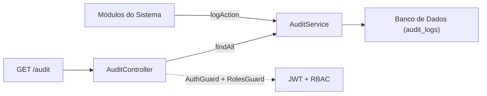
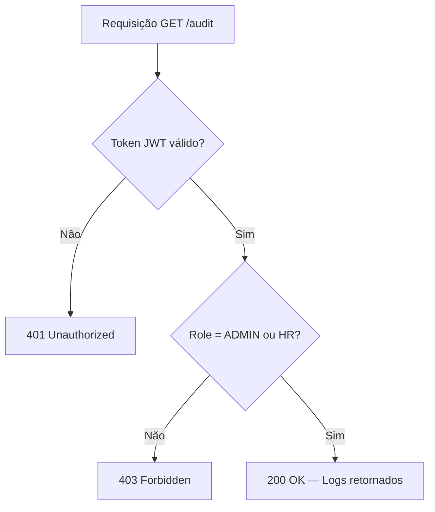

# 📋 Módulo de Auditoria (Audit)

## Visão Geral

O módulo de auditoria é responsável por registrar e expor todas as ações críticas realizadas no sistema Atlas HRMS. Ele atua como um **Audit Trail** imutável, armazenando cada operação relevante com detalhes descritivos, timestamp e referência ao usuário executor.

---

## Arquitetura



O `AuditService` é registrado como `@Global()`, permitindo que qualquer módulo injete e utilize o método `logAction` sem necessidade de importar explicitamente o `AuditModule`.

---

## Modelo de Dados

| Campo       | Tipo       | Descrição                                            |
|-------------|------------|------------------------------------------------------|
| `id`        | `String`   | UUID gerado automaticamente                          |
| `action`    | `String`   | Identificador da ação (ex: `JOB_CREATED`)            |
| `details`   | `String`   | Descrição detalhada da operação realizada             |
| `timestamp` | `DateTime` | Data/hora do registro (gerado automaticamente)       |
| `userId`    | `String?`  | Referência ao usuário executor (nullable para ações públicas) |

---

## Endpoint

### `GET /audit`

Recupera a lista cronológica completa de todos os logs de auditoria.

| Atributo       | Valor                       |
|----------------|-----------------------------|
| **Autenticação** | JWT Bearer Token            |
| **Permissões**   | `ADMIN`, `HR`               |
| **Ordenação**    | `timestamp DESC` (mais recente primeiro) |

#### Resposta (`200 OK`)

```json
[
  {
    "id": "a1b2c3d4-e5f6-4a0b-bc11-ce1338dfd1d2",
    "action": "JOB_CREATED",
    "details": "Vaga \"Desenvolvedor Backend Sênior\" criada com status DRAFT",
    "timestamp": "2026-07-15T14:30:00.000Z",
    "user": {
      "id": "f47ac10b-58cc-4372-a567-0e02b2c3d479",
      "email": "admin@atlas.com",
      "role": "ADMIN"
    }
  },
  {
    "id": "b2c3d4e5-f6a7-4b0c-cd22-df2449efe2e3",
    "action": "APPLICATION_RECEIVED",
    "details": "Candidatura recebida de Maria Oliveira para a vaga \"Dev Backend\"",
    "timestamp": "2026-07-15T14:25:00.000Z",
    "user": null
  }
]
```

> [!NOTE]
> O campo `user` será `null` para ações disparadas por fluxos públicos (ex: candidaturas de emprego), onde não há usuário autenticado no momento da gravação.

#### Respostas de Erro

| Status | Descrição                                     |
|--------|-----------------------------------------------|
| `401`  | Token JWT ausente ou inválido                 |
| `403`  | Usuário não possui permissão (`EMPLOYEE`, `MANAGER`) |

---

## Controle de Acesso (RBAC)



---

## Ações de Auditoria Registradas

O enum `AuditAction` centraliza todas as ações tipadas do sistema:

| Ação                              | Módulo       | Descrição                                     |
|-----------------------------------|--------------|-----------------------------------------------|
| `JOB_CREATED`                     | Recrutamento | Vaga de emprego criada                        |
| `JOB_UPDATED`                     | Recrutamento | Vaga de emprego atualizada                    |
| `JOB_PUBLISHED`                   | Recrutamento | Vaga publicada (status → OPEN)                |
| `JOB_CLOSED`                      | Recrutamento | Vaga fechada ou excluída                      |
| `APPLICATION_RECEIVED`            | Recrutamento | Nova candidatura recebida                     |
| `CANDIDATE_STATUS_CHANGED`        | Recrutamento | Status de candidatura alterado no pipeline     |
| `CANDIDATE_CONVERTED_TO_EMPLOYEE` | Recrutamento | Candidato convertido em funcionário            |
