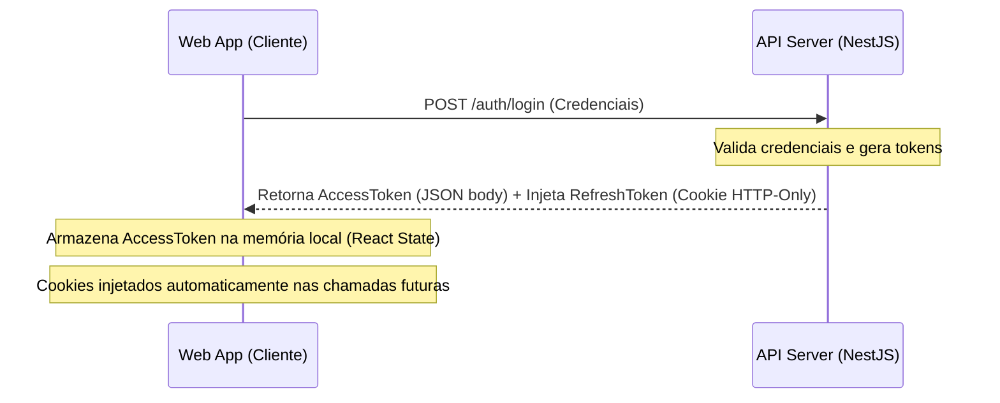

# 🔐 Autenticação, Segurança e Permissões

Esta seção documenta a arquitetura de segurança, autenticação e controle de privilégios implementada no **Atlas HRMS**.

---

## 🔑 Estratégia de Tokens JWT

Para garantir alta segurança e mitigar riscos de ataques XSS (Cross-Site Scripting) e CSRF (Cross-Site Request Forgery), adotamos a divisão de responsabilidade de tokens:



### 1. Access Token (`accessToken`)

- **Tempo de Expiração**: 15 minutos (curto ciclo de vida).
- **Armazenamento**: Mantido estritamente na **memória da aplicação** (React state/Zustand) no frontend. Nunca deve ser salvo no `localStorage` ou `sessionStorage`, eliminando a exposição a scripts maliciosos (XSS).

### 2. Refresh Token (`refreshToken`)

- **Tempo de Expiração**: 7 dias (longo ciclo de vida).
- **Armazenamento**: Injetado pelo servidor via cabeçalho `Set-Cookie` com as seguintes flags de segurança:
  - `HttpOnly`: Impede o acesso ao cookie via código JavaScript no cliente.
  - `Secure`: Garante que o cookie só seja trafegado por conexões seguras HTTPS (em desenvolvimento, aceita HTTP).
  - `SameSite=Strict`: Restringe o envio do cookie apenas para requisições que se iniciem no mesmo domínio, mitigando ataques de CSRF.
  - `Path=/auth/refresh`: O cookie é enviado pelo navegador exclusivamente para a rota de atualização, protegendo as demais rotas da API.

---

## 🧱 Mitigação de Ataques de Força Bruta (Account Lockout)

O sistema conta com proteção nativa contra ataques automatizados de adivinhação de senhas bloqueando temporariamente a conta de forma gradativa com base no número de tentativas inválidas consecutivas (`failedAttempts`):

| Tentativas Falhas | Ação Executada                          | Duração do Bloqueio              |
| :---------------- | :-------------------------------------- | :------------------------------- |
| **Até 4**         | Login rejeitado; contador incrementado. | Sem bloqueio.                    |
| **5 a 9**         | Conta é bloqueada temporariamente.      | **10 minutos** (`lockoutUntil`). |
| **10 ou mais**    | Bloqueio temporário estendido.          | **30 minutos** (`lockoutUntil`). |

_Nota: O contador de tentativas falhas é zerado imediatamente após um login bem-sucedido._

---

## 🚦 Limitador de Requisições (Rate Limiting)

Para evitar negação de serviço (DoS) e abuso das rotas sensíveis, o `ThrottlerGuard` é aplicado globalmente na API NestJS:

- **Baseline Global**: Máximo de **100 requisições** a cada **1 minuto** por endereço IP.
- **Rotas de Autenticação (`AuthModule`)**: Regra restritiva adicional permitindo no máximo **10 requisições** a cada **1 minuto** por IP para endpoints como login, registro e refresh.

---

## 🛡️ Controle de Acesso Baseado em Cargos (RBAC)

O controle de autorização é implementado através do decorador `@Roles()` combinado ao interceptor `RolesGuard` no NestJS:

```typescript
// Exemplo de rota restrita para Administradores ou Recursos Humanos
@Post('employee')
@Roles(UserRole.ADMIN, UserRole.HR)
@UseGuards(JwtAuthGuard, RolesGuard)
async createEmployee(@Body() dto: CreateEmployeeDto) {
  return this.employeeService.create(dto);
}
```

O `RolesGuard` lê o token JWT decodificado do usuário (`req.user.role`) e compara com as permissões exigidas no metadata da rota usando o `Reflector`. Caso o usuário não tenha o nível de cargo necessário, o servidor retorna automaticamente `403 Forbidden`.

---

## 📝 Logs de Auditoria (`AuditLog`)

Todas as ações críticas no ciclo de vida de autenticação e segurança são persistidas na tabela `audit_logs` pelo serviço `AuditService`:

- **Registro de Contas**: Loga a criação de novos usuários no sistema.
- **Logins com Sucesso**: Loga a entrada de usuários, permitindo histórico de logins.
- **Logins Falhos**: Registra cada tentativa inválida indicando o e-mail alvo.
- **Bloqueio de Contas (Lockout)**: Emite um log de alerta informando quando e por quanto tempo um usuário foi bloqueado.
