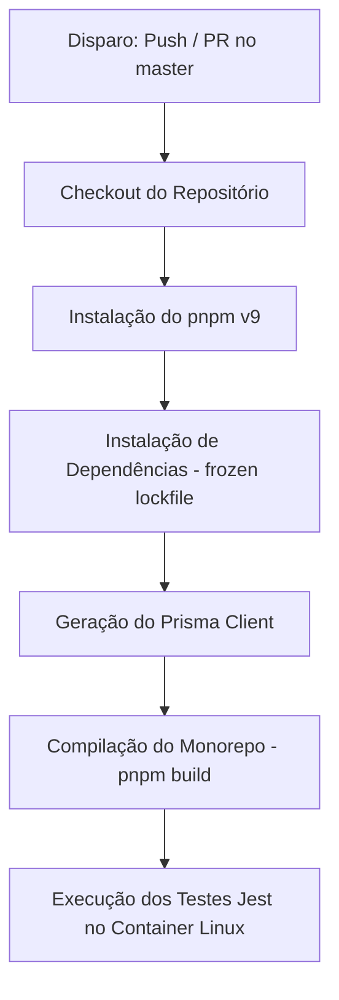

# 🧪 Testes e Integração Contínua (CI/CD)

Esta seção documenta a infraestrutura de testes automatizados e o fluxo de integração contínua (CI/CD) do projeto.

---

## 🔬 Stack de Testes

O ecossistema de testes do backend (`apps/api`) é composto pelas seguintes ferramentas:

- **Jest**: Framework de testes e asserções.
- **Supertest**: Execução de chamadas HTTP integradas simulando chamadas reais à API REST.
- **@nestjs/testing**: Auxilia na criação de módulos isolados e mocks rápidos para injeção de dependências do NestJS.
- **@swc/jest**: Transpilador ultra rápido baseado em Rust usado para executar os testes TypeScript em milissegundos.

---

## 🏃 Como Executar os Testes Localmente

Acesse a raiz do projeto e utilize o pnpm para direcionar os comandos para o workspace da API:

```bash
# Executa todos os testes unitários e de integração
pnpm --filter @atlas/api test

# Executa testes em modo de observação (watch mode)
pnpm --filter @atlas/api run test:watch

# Gera relatório de cobertura de código (code coverage)
pnpm --filter @atlas/api run test:cov
```

---

## ⚓ Git Hooks locais (Husky + Lint-staged)

Para garantir a qualidade do código e evitar commits quebrados no repositório, configuramos githooks locais automáticos:

1. **`lint-staged`**:
   - Sempre que você digita `git commit`, o Husky intercepta o processo e envia apenas os arquivos modificados (staged) que terminam em `.ts`, `.tsx`, `.js`, `.json`, `.css` ou `.md` para validação e formatação automática com **Prettier** e **ESLint**.
2. **Pre-commit Test Execution**:
   - Após a formatação rápida, o Husky executa de forma síncrona o comando de teste da API (`pnpm --filter @atlas/api test`). Se algum teste quebrar, o commit é imediatamente abortado, impedindo o envio de erros para o repositório compartilhado.

---

## 🚀 Esteira de CI/CD (GitHub Actions)

Toda vez que um desenvolvedor realiza um `push` ou cria um `Pull Request` direcionado para a branch `master`, o GitHub Actions dispara automaticamente o pipeline técnico definido no arquivo `.github/workflows/ci.yml`.

### Fluxo de Trabalho do Pipeline:



### Configurações de Robustez no CI/CD:

- **Node.js 24**: O runner utiliza a última versão estável recomendada do Node.js.
- **Bypass de Compilador Nativo (Next.js)**: Como o compilador Rust do Turbopack pode apresentar instabilidades nativas sob ambientes virtualizados de Linux com Node 24, configuramos o parâmetro `NEXT_PRIVATE_LOCAL_WEBPACK: true` durante o build no CI, direcionando o Next.js 16 para o empacotador estável do Webpack.
- **Isolamento de Linting**: Definimos `NEXT_DISABLE_ESLINT: 1` no build, delegando a responsabilidade de formatação e linting para o comando dedicado executado nos hooks locais e testes, acelerando o tempo final de build no CI.
- **Dependência Estrita**: O passo de testes no contêiner garante que novas rotas e lógicas de segurança só entrem na branch estável se passarem por 100% da esteira de validação.
