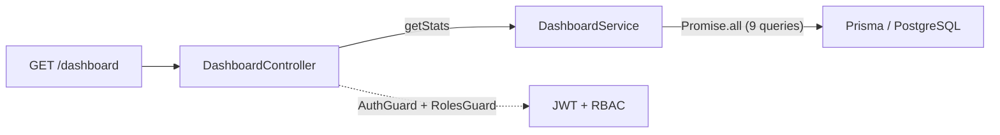
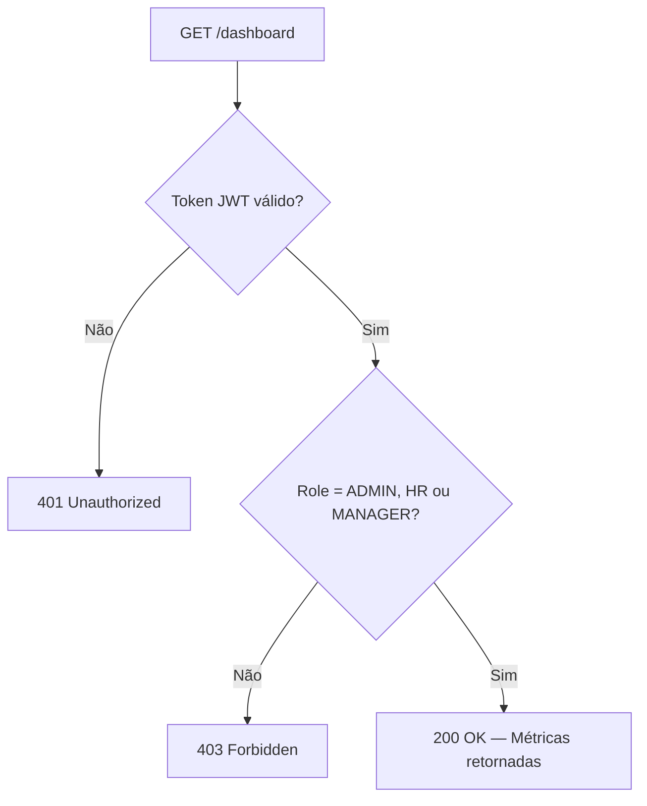

# 📊 Módulo de Dashboard (Métricas Consolidadas)

## Visão Geral

O módulo de Dashboard fornece um endpoint agregador que consolida métricas operacionais de RH em tempo real, permitindo que administradores, gestores e equipe de RH monitorem indicadores-chave de funcionários, ausências e recrutamento em uma única requisição otimizada.

---

## Arquitetura



Todas as 9 consultas ao banco são executadas em paralelo via `Promise.all` para minimizar o tempo de resposta.

---

## Métricas Calculadas

### Métricas Gerais

| Métrica | Tabela | Filtro |
|---------|--------|--------|
| `totalEmployees` | `Employee` | `deletedAt = null` |
| `totalDepartments` | `Department` | `deletedAt = null` |

### Férias e Licenças (Ausências)

| Métrica | Tabela | Filtro |
|---------|--------|--------|
| `pendingVacations` | `Vacation` | `status = PENDING`, `deletedAt = null` |
| `pendingLeaves` | `Leave` | `status = PENDING`, `deletedAt = null` |
| `activeAbsences` | `Vacation` + `Leave` | `status = APPROVED`, `deletedAt = null`, `startDate ≤ hoje ≤ endDate` |

> [!NOTE]
> `activeAbsences` é a soma de férias aprovadas em vigência + licenças aprovadas em vigência no dia atual.

### Recrutamento (ATS)

| Métrica | Tabela | Filtro |
|---------|--------|--------|
| `openJobs` | `Recruitment` | `status = OPEN`, `deletedAt = null` |
| `totalApplications` | `Application` | `status ≠ WITHDRAWN`, `deletedAt = null` |
| `hiredCount` | `Application` | `status = HIRED`, `deletedAt = null` |

---

## Endpoint

### `GET /dashboard`

Consolida todas as métricas em uma resposta agregada.

| Atributo | Valor |
|----------|-------|
| **Autenticação** | JWT Bearer Token |
| **Permissões** | `ADMIN`, `HR`, `MANAGER` |

#### Resposta (`200 OK`)

```json
{
  "totalEmployees": 142,
  "totalDepartments": 12,
  "pendingVacations": 8,
  "pendingLeaves": 3,
  "activeAbsences": 15,
  "openJobs": 5,
  "totalApplications": 87,
  "hiredCount": 12
}
```

#### Respostas de Erro

| Status | Descrição |
|--------|-----------|
| `401` | Token JWT ausente ou inválido |
| `403` | Usuário `EMPLOYEE` tentando acessar |

---

## Controle de Acesso (RBAC)


