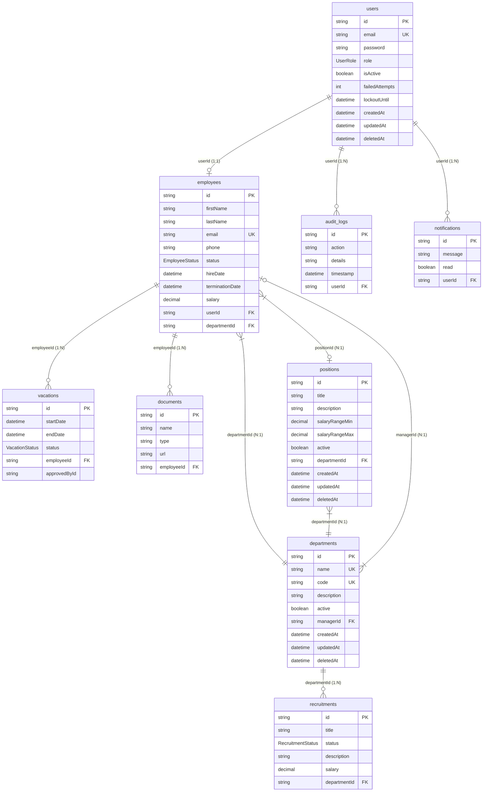

# 🗄️ Modelagem de Banco de Dados

O banco de dados do **Atlas HRMS** é modelado usando PostgreSQL e abstraído com o **Prisma ORM**. Todas as migrações de dados e tabelas são coordenadas através do arquivo de configuração do Prisma localizado em `apps/api/prisma/schema.prisma`.

---

## 📊 Diagrama de Entidade-Relacionamento (ER)

Abaixo está a representação visual das tabelas do banco de dados e suas respectivas chaves e relacionamentos:

---

## 🔐 Definições Principais de Domínio

### Enums Importantes:

- **`UserRole`**: Define a hierarquia do RBAC no sistema de autenticação.
  - `ADMIN`: Administrador com plenos poderes de acesso e auditoria.
  - `HR`: Operador de recursos humanos (gestão de funcionários, férias e vagas).
  - `MANAGER`: Gestor de equipe.
  - `EMPLOYEE`: Funcionário regular (acesso às suas próprias férias e dados).
- **`EmployeeStatus`**: `ACTIVE`, `INACTIVE`, `ON_LEAVE`, `SUSPENDED`.
- **`VacationStatus`**: `PENDING`, `APPROVED`, `REJECTED`, `CANCELLED`.
- **`RecruitmentStatus`**: `OPEN`, `CLOSED`, `ON_HOLD`, `DRAFT`.
