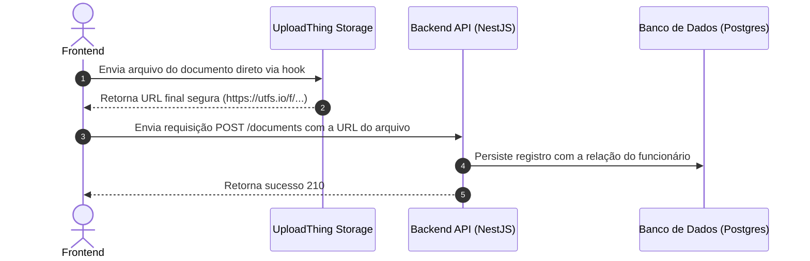

# Módulo de Documentos de Funcionários (Documents)

O módulo de **Documentos** gerencia o upload de arquivos e documentos pessoais dos funcionários (RG, CPF, Comprovante de Residência, Contratos) integrados ao **UploadThing**.

## Fluxo de Upload e Armazenamento (Direct-to-Cloud)

---

## Regras de Negócio e Permissões (RBAC)

### 1. Tipo de Documento
Toda inclusão deve categorizar o documento em um dos tipos válidos (`CONTRACT`, `IDENTIFICATION`, `EDUCATION`, `ADDRESS_PROOF`, `OTHER`).

### 2. Controle de Permissões
*   **Funcionários comuns (`EMPLOYEE`)**: Podem criar/enviar seus próprios documentos e listar os seus próprios documentos. Não podem visualizar nem gerenciar arquivos de terceiros.
*   **Gestores (`MANAGER`)**: Podem listar e pesquisar documentos de funcionários.
*   **RH e Administradores (`HR` / `ADMIN`)**: Possuem controle total. Apenas estes perfis têm permissão para deletar arquivos permanentemente (`DELETE /documents/:id`).

### 3. Deleção de Arquivos
Sempre que um documento é excluído da API, a URL é analisada, a chave exclusiva (`fileKey`) do arquivo é extraída e a API NestJS remove fisicamente o arquivo do bucket do UploadThing usando `UploadthingService.deleteFile()`.
