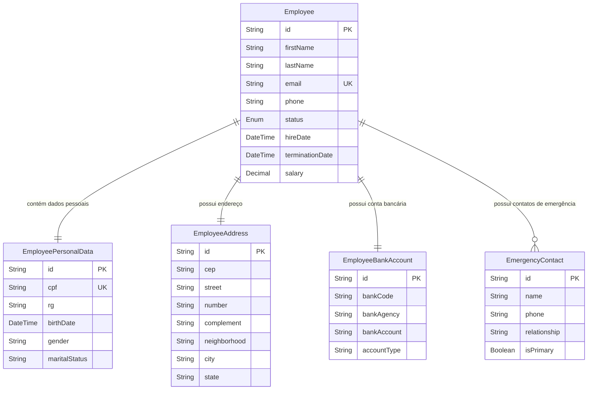

# Gestão de Funcionários (Employees)

Este documento descreve a arquitetura de dados, fluxos de negócio e segurança da API de Gestão de Funcionários (`Employees`) do Atlas HRMS.

## Arquitetura de Entidades e Relacionamentos

A entidade de funcionário foi dividida de maneira modular para otimizar a performance de escrita e leitura de dados na folha e no perfil, seguindo a normalização do banco de dados relacional.

## Controle de Acesso e Perfis (RBAC)

O acesso aos endpoints da rota `/employees` é protegido de forma rígida baseando-se no papel (`UserRole`) do usuário autenticado no sistema:

| Método HTTP | Endpoint         | Papéis Permitidos (RBAC) | Descrição                                                                            |
| ----------- | ---------------- | ------------------------ | ------------------------------------------------------------------------------------ |
| **GET**     | `/employees`     | `ADMIN`, `HR`, `MANAGER` | Lista todos os funcionários ativos com relações básicas.                             |
| **GET**     | `/employees/:id` | `ADMIN`, `HR`, `MANAGER` | Detalhes completos do funcionário incluindo dados pessoais, bancários e emergências. |
| **POST**    | `/employees`     | `ADMIN`, `HR`            | Cadastro transacional de um novo funcionário com dados aninhados.                    |
| **PUT**     | `/employees/:id` | `ADMIN`, `HR`            | Atualização completa de dados aninhados do funcionário.                              |
| **DELETE**  | `/employees/:id` | `ADMIN`, `HR`            | Remoção lógica (Soft Delete) do funcionário e inativação de seu usuário.             |

## Validações Integradas

- **CPF**: Validação algorítmica real (cálculo de dígitos verificadores decimais) rejeitando strings falsas ou com números repetidos, aceitando os formatos `000.000.000-00` ou apenas dígitos.
- **CEP & ViaCEP**: Validação estrutural sob expressão regular exigindo o formato `00000-000` ou 8 dígitos absolutos. No formulário de cadastro, a digitação de um CEP válido aciona uma busca integrada e assíncrona na API pública ViaCEP, preenchendo automaticamente os campos de Logradouro, Bairro, Cidade e Estado.
- **Datas**: Validação de data string sob padrão ISO.

## Regras de Cadastro Inicial

1. **Flexibilização dos Blocos**: Os dados de Endereço (`EmployeeAddress`) e Dados Bancários (`EmployeeBankAccount`) não são mais obrigatórios no momento da criação inicial do funcionário na API e no formulário do frontend, facilitando cadastros parciais rápidos.
2. **Remoção da URL do Avatar**: O campo para digitação de URL do avatar foi removido do formulário de criação, transferindo a responsabilidade de upload da foto de perfil para o próprio usuário na tela de configurações de perfil.
