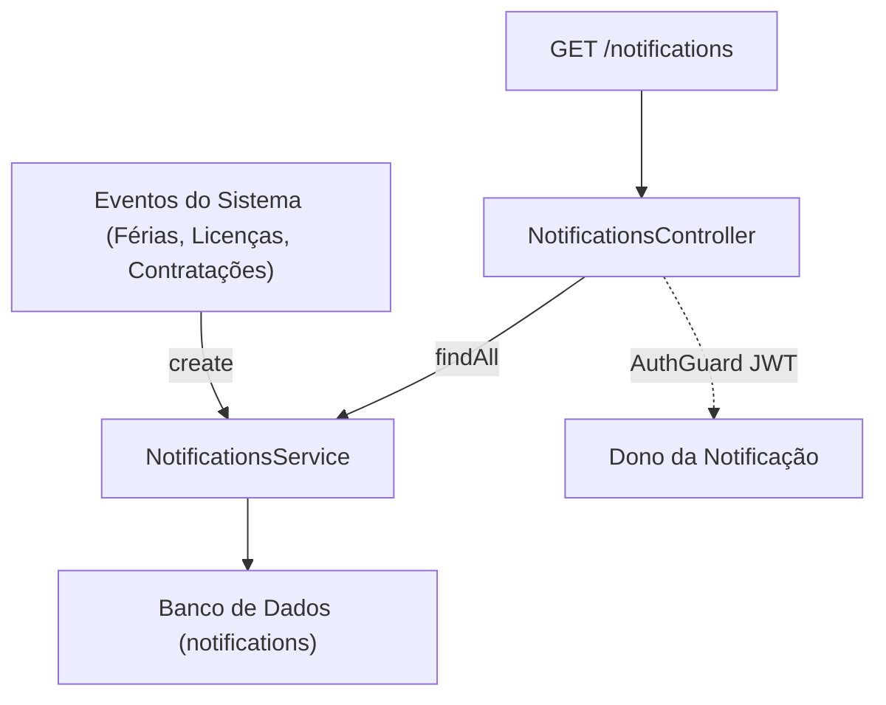

# 🔔 Módulo de Notificações Internas (Notifications)

O módulo de **Notificações** gerencia o disparo e a leitura de alertas internos para os usuários do sistema. Ele serve para centralizar mensagens automáticas geradas por eventos corporativos do Atlas HRMS.

## Arquitetura do Fluxo de Notificações



---

## Regras de Negócio e Permissões (RBAC)

### 1. Criação de Notificações (`POST /notifications`)

- **Acesso Administrativo**: Apenas usuários com privilégios **`ADMIN`** ou **`HR`** podem criar notificações arbitrariamente para outros usuários.
- **Mensagens Automáticas**: O serviço global `NotificationsService` pode ser injetado em outros módulos para disparar avisos em segundo plano durante operações críticas.

### 2. Leitura de Notificações

- **Propriedade de Conta**: Um funcionário comum (`EMPLOYEE`) só pode listar notificações enviadas especificamente para ele (`userId === loggedInUser.id`). A rota decodifica o usuário autenticado de forma implícita, prevenindo a adulteração de parâmetros de rota.
- **Atualização de Status (`PUT /notifications/:id/read`)**: Marca a notificação como lida (`read = true`). Apenas o destinatário direto ou um usuário `ADMIN` têm permissão para disparar essa ação.

---

## Endpoints do Módulo

### `GET /notifications`

- **Autenticação**: Requer JWT
- **Permissões**: Todos os perfis autenticados
- **Resposta**: `200 OK` retornando a lista de notificações em ordem cronológica reversa (`createdAt DESC`).

### `POST /notifications`

- **Autenticação**: Requer JWT
- **Permissões**: `ADMIN`, `HR`
- **Body (JSON)**:
  ```json
  {
    "userId": "uuid-do-destinatario",
    "message": "Suas férias de dezembro foram aprovadas!"
  }
  ```

### `PUT /notifications/:id/read`

- **Autenticação**: Requer JWT
- **Permissões**: Dono da notificação ou `ADMIN`
- **Resposta**: `200 OK` com a notificação atualizada.
