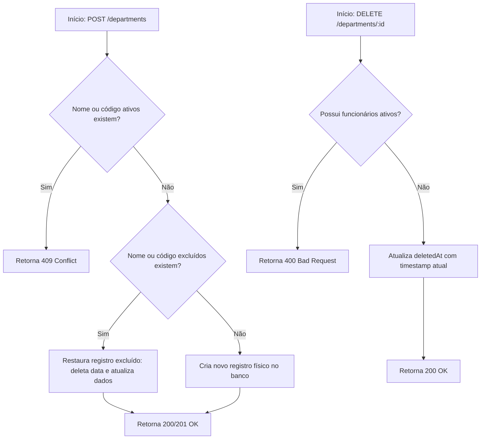

# 🏛️ Estrutura Organizacional - Módulo de Departamentos

O módulo de departamentos (`Department`) é o núcleo da estrutura organizacional do **Atlas HRMS**. Ele serve como base para agrupar cargos (`Position`) e funcionários (`Employee`), estruturando a hierarquia corporativa do sistema.

---

## 🗺️ Modelo de Dados (Atributos)

Os departamentos contêm as seguintes propriedades descritas em banco de dados:

| Campo         | Tipo            | Descrição                                            | Restrição          |
| :------------ | :-------------- | :--------------------------------------------------- | :----------------- |
| `id`          | `String (UUID)` | Identificador exclusivo do departamento.             | Chave Primária     |
| `name`        | `String`        | Nome descritivo (ex: "Recursos Humanos").            | Único, Obrigatório |
| `code`        | `String`        | Código identificador (ex: "RH").                     | Único, Obrigatório |
| `description` | `String`        | Descrição detalhada das responsabilidades.           | Opcional           |
| `active`      | `Boolean`       | Determina se o departamento está ativo.              | Padrão: `true`     |
| `managerId`   | `String (UUID)` | ID do funcionário (`Employee`) que gerencia o setor. | Opcional (1:N)     |
| `createdAt`   | `DateTime`      | Data de criação automática.                          | Obrigatório        |
| `updatedAt`   | `DateTime`      | Data de última modificação.                          | Obrigatório        |
| `deletedAt`   | `DateTime`      | Data de exclusão lógica (Soft-Delete).               | Opcional           |

---

## 🔄 Fluxo de Exclusão Lógica e Reativação (Soft-Restore)

Para manter a integridade de chaves históricas e evitar registros órfãos, o sistema utiliza exclusão lógica (**Soft-Delete**). Além disso, implementa um fluxo amigável de **Soft-Restore** para evitar conflitos de unicidade no banco de dados.

### Diagrama de Fluxo de Criação/Exclusão:

---

## 🔐 Controle de Acesso (RBAC)

O acesso às rotas do controlador de departamentos é protegido pelo `AuthGuard` e validado com base na regra de papéis (`RolesGuard`):

- **Leitura (`GET /departments` e `GET /departments/:id`)**:
  - **Papéis Permitidos**: `ADMIN`, `HR`, `MANAGER`, `EMPLOYEE`.
  - **Objetivo**: Permitir que qualquer usuário autenticado possa consultar a estrutura corporativa.
- **Escrita (`POST`, `PUT`, `DELETE`)**:
  - **Papéis Permitidos**: `ADMIN`, `HR`.
  - **Objetivo**: Restringir modificações estruturais apenas a administradores e gestores de recursos humanos.
