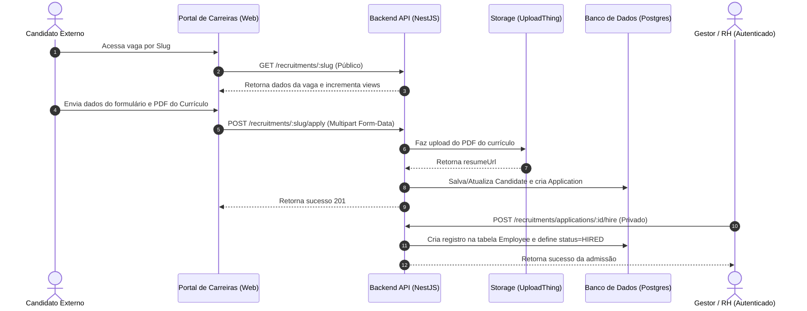

# Recrutamento & Vagas (Recruitment & ATS)

O módulo de **Recrutamento** (ATS - Applicant Tracking System) gerencia a publicação de processos seletivos e candidaturas públicas no Atlas HRMS.

## Visão Geral do Fluxo de Candidatura (ATS)

---

## Regras de Negócio e Lógica de Fluxo

### 1. Portal de Carreiras Público (Sem Autenticação)
*   **Visibilidade das Vagas**: Apenas vagas com status `OPEN` e que não estejam expiradas (`expiresAt > NOW()` ou nulas) aparecem no portal público.
*   **Incremento de Visualizações**: Sempre que os detalhes de uma vaga são acessados via slug, o contador `views` é incrementado em 1.
*   **Controle de Faixa Salarial**: Se o campo `isSalaryVisible` for `false`, os valores de `salaryMin` e `salaryMax` são ocultados nos retornos públicos da API.

### 2. Cadastro Único de Candidato (`Candidate`)
*   Para evitar duplicação, o sistema utiliza o **e-mail** como chave única do candidato. Se um candidato aplicar para outra vaga futuramente, seus dados de contato são atualizados e vinculados a uma nova candidatura (`Application`), mas nenhum novo registro de `Candidate` é criado.
*   A restrição única garante que um mesmo candidato não pode aplicar duas vezes para a **mesma vaga** (`ConflictException 409`).

### 3. Pipeline de Candidaturas
A vaga transiciona entre as seguintes etapas:
`SUBMITTED` ➔ `SCREENING` ➔ `HR_INTERVIEW` ➔ `TECHNICAL_TEST` ➔ `TECHNICAL_INTERVIEW` ➔ `FINAL_INTERVIEW` ➔ `OFFER` ➔ `HIRED` (ou `REJECTED` / `WITHDRAWN`).

### 4. Ação Explícita de Contratação (`/hire`)
Quando a vaga chega na etapa final e o RH executa a chamada ao endpoint `POST /recruitments/applications/:id/hire`:
1.  Os dados pessoais do candidato são copiados.
2.  Um registro do funcionário é criado automaticamente em `Employee` vinculando o cargo (`positionId`) e departamento (`departmentId`) da vaga.
3.  O status da candidatura muda para `HIRED` e salva o timestamp em `hiredAt` (útil para auditorias e painéis de métricas).

---

## Paginação, Busca e Filtros

As listagens aceitam os parâmetros opcionais:
*   `page` e `limit` para paginação de dados.
*   `search` para pesquisa de texto simples insensível a maiúsculas no título ou descrição.
*   `departmentId`, `seniority`, `workModel`, `employmentType` para filtragem direcionada.
