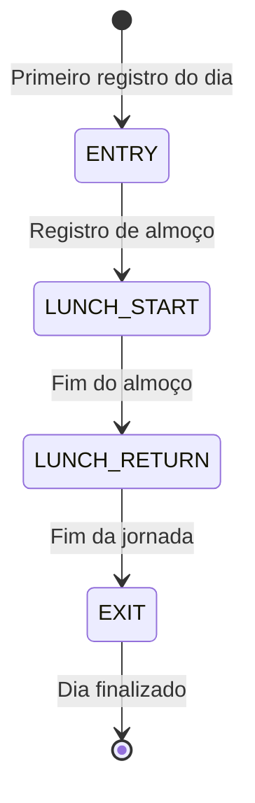
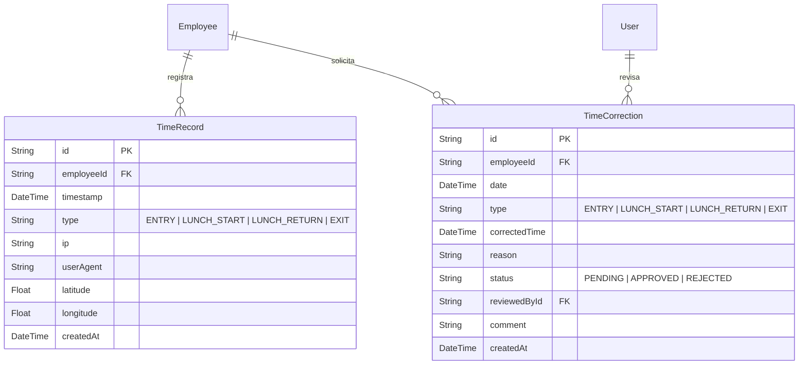

# Ponto Eletrônico (Time & Attendance)

Este documento descreve a arquitetura, regras de negócio, endpoints da API e fluxos de banco de dados do módulo de Ponto Eletrônico no Atlas HRMS.

---

## 1. Visão Geral

O módulo de Ponto Eletrônico permite que os colaboradores registrem suas jornadas diárias de trabalho com auditoria física (IP, User-Agent e coordenadas de Geolocalização). Gestores e Administradores podem revisar o banco de horas e aprovar ou rejeitar solicitações de correção de ponto enviadas pelos colaboradores.

---

## 2. Regras de Negócio e Estados do Ponto

### Batida Sequencial Inteligente

O sistema bloqueia batidas fora de ordem para manter a integridade da jornada de trabalho. A ordem diária obrigatória das batidas de ponto é:

1. `ENTRY` (Entrada)
2. `LUNCH_START` (Saída para Almoço)
3. `LUNCH_RETURN` (Retorno do Almoço)
4. `EXIT` (Saída Final)



### Auditoria e Geolocalização

Cada registro de ponto coleta automaticamente:

- **IP**: Endereço IP de origem da requisição.
- **User-Agent**: Navegador e sistema operacional do dispositivo utilizado.
- **Coordenadas**: Latitude e longitude opcionais enviadas via API de Geolocalização do navegador.

---

## 3. Modelo de Entidade-Relacionamento

Os dados são armazenados utilizando as tabelas `TimeRecord` (registros de ponto físicos) e `TimeCorrection` (solicitações de ajuste de jornada).



---

## 4. Endpoints da API

Todas as rotas estão sob o prefixo `/time-attendance` e exigem autenticação.

### Registros de Ponto (`/time-attendance/records`)

- `POST /time-attendance/records`
  - **Permissão**: Todos os colaboradores autenticados.
  - **Descrição**: Registra um novo ponto (Entrada, Almoço, Volta ou Saída).
  - **Payload**:
    ```json
    {
      "type": "ENTRY",
      "latitude": -23.5505,
      "longitude": -46.6333
    }
    ```
- `GET /time-attendance/records/today`
  - **Permissão**: Todos os colaboradores.
  - **Descrição**: Retorna o estado e as batidas registradas pelo colaborador logado no dia atual.

### Correções de Ponto (`/time-attendance/corrections`)

- `POST /time-attendance/corrections`
  - **Permissão**: Todos os colaboradores.
  - **Descrição**: Cria uma solicitação de correção/ajuste de ponto retroativo.
- `GET /time-attendance/corrections/my-requests`
  - **Permissão**: Todos os colaboradores.
  - **Descrição**: Lista o histórico de solicitações de ajuste feitas pelo colaborador logado.
- `GET /time-attendance/corrections/pending`
  - **Permissão**: Apenas Admin e RH.
  - **Descrição**: Lista todas as solicitações pendentes de revisão.
- `PUT /time-attendance/corrections/:id/approve`
  - **Permissão**: Apenas Admin e RH.
  - **Descrição**: Aprova uma correção, criando/ajustando automaticamente o registro de ponto correspondente no banco.
- `PUT /time-attendance/corrections/:id/reject`
  - **Permissão**: Apenas Admin e RH.
  - **Descrição**: Rejeita a solicitação e adiciona uma justificativa/comentário.
